# Curso de Git & Github

## Descripción del curso 🚀 
📝 Este documento contiene mis notas personales sobre el curso de git y github para las configuraciones iniciales de git como los comandos que se utilizan para trabajar con proyectos de software, del mismo modo revisaremos las mejores practicas que se utilizan en git.

 ## 📋 Índice
> 1. [**Introducción a Git** 🚀](#introducción-a-git)
> 2. [**States y commits** 🚀](#states-y-commits)


## Introducción a Git


### ¿Qué es Git? 🤔
Git es un sistema distribuido de control de versiones, gratuito y de código abierto bajo licencia GPLv2. Fue diseñado originalmente por Linus Torvalds12, el creador de Linux.
Git, al ser un sistema distribuido, aloja una copia completa del repositorio en cada máquina local que está trabajando en el código.


### Instalación Git

**➊ Linux(Ubuntu\Debian) 🐧**

* Lo instalamos desde el repositorio de software de nuestra distrubución ejecutamos los siguientes comandos en nuestra terminal:

    ```
    sudo apt update
    sudo apt install git
    ```
* Verificamos la version de git que se instalo:
    ```
    git --version
    ```
Con eso ya tenemos git funcionando en nuestro Debian 💯

**➋ MacOS 🍏**

 En macOS la forma de instalar git es con **Homebrew** a continuación te dejo los pasos para la instalación correctamente:
* Instalar **Homebrew** si aún no lo tienes instalado 🔧
* Instalar git con brew 🔥
* Verificamos la versión de git que se instalo 💯

    ```
    xcode-select --install/bin/bash -c "$(curl -fsSL https://raw.githubusercontent.com/Homebrew/install/HEAD/install.sh)"

    brew install git

    git --version
    ```

**➌ Windows 💻**

En Windows es más sencillo descargar el instalador oficial y seguir los pasos del
asistente:

* Descargarga el instalador de 👉[https://git-scm.com/download/win](https://git-scm.com/download/win)

* Ejecuta el instalador 🔥

* Finaliza la instalación 💯

### Configuración de Git 🛠️

Para hacer que tus commits se asocien a tu nombre y aparezca correctamente tu
avatar en la plataforma de GitHub, necesitamos realizar la siguiente configuración.


1. Configura tu nombre 😀

    ```
    git config --global user.name "<tu nombre>"
    ```
2. Configura tu correo electronico ✉️

    ```
    git config --global user.email "<tu email>"
    ```
📌**NOTA**: El correo electronico tiene que ser el mismo con el que estas registrado en Github

**Otras configuraciones adicionales ⚙️** 

* Para comprobar nuestra configuración de git ejecutamos el siguiente comando

    ```
    git config --list
    ```
* Si necesitamos ayuda y mas opciones de configuración 

    ```
    git config --help
    ```

### Inicializar un repositorio Git desde cero y subirlo a GitHub 🐱

**➊ Creamos nuestro archivo README.md**

* Este archivo contendra toda la información sobre nuestro proyecto.

    ```
    echo "# Curso-Git-Github-SCESI2025" >> README.md
    ```
**➋ Inicializar un repositorio**

 * Inicializamos un repositorio Git vacío en tu nuestra carpeta actual.

    ```
    git init
    ```
Con eso ya tenemos inicializado nuestro repositorio pero solamente de forma local.

**➌ Agregar el archivo**

* Agregamos nuestro archivo README.md al área de preparación para que se pueda subir a Github.

    ```
    git add README.md
    ```

**➍ Commit inicial**

* Creamos nuestro primer commit para que se guarden los cambios del README.md

    ```
    git commit -m "first commit"
    ```

**➎ Cambio de nombre de la rama**

* Cambiamos el nombre de nuestra rama a main ya que inicialmente esta con Master

    ```
    git branch -M main
    ```

**➏ Conexión del repositorio local con el remoto**

* Conectamos nuestro repositorio local con el remoto con la url que nos proporciona Github 

    ```
    git remote add origin https://github.com/TuNombreDeGithub/Curso-Git-Github-SCESI2025.git
    ```

**➐ Envio del commit a Github**

* Enviamos el commit inicial que realizamos a la rama main, el -u vincula nuestra rama local con la rama remota.

    ```
    git push -u origin main
    ```

Listo y con esos 7 pasos ya tenemos nuestro repositorio Git Inicializado y subido a Github 😎

## States y commits

### Los 3 estados de Git 🎯
Cuando usamos Git, los archivos de nuestro proyecto se pueden encontrar en uno de los siguientes
estados:

1. Modified: El archivo contiene cambios pero todavía no han sido
marcados para ser confirmados. Se encuentra en el directorio de trabajo.

2. Staged: Son los archivos que han sido modificados en el directorio
de trabajo y se han marcado como preparados para ser confirmados en el
repositorio local. Se encuentran en un área temporal transitoria. Esta acción
recibe el nombre de add.

3. Committed: El archivo se encuentra grabado en el repositorio
local. Esta acción recibe el nombre de commit.


### ¿Qué es un commit? 🤔
* 📝 Los commits sirven para registrar los cambios que se han producido en el repositorio, es una de las piezas más importantes para entender cómo funciona Git.

* 📷 Piensa en los commits como si fuesen fotografías. Cada fotografía muestra el
estado de todos los archivos de tu repositorio en el momento en que se hizo y cada una va firmada con el autor, la fecha, localización y otra información útil.

* 🎮 En pocas palabras un commit es como un punto de guardado de la partida de tu juego.

**¿Cómo puedo hacer un commit?**
1. Si quieres guardar los cambios que tienes en el área de staging, puedes hacer un commit con el siguiente comando:

    ```
    git commit
    ```

2. Si quieres añadir directamente un mensaje sin abrir el editor, puedes usar el
parámetro -m o --message:

    ```
    git commit -m "Add new search feature"
    ```

### ¿Qué es el HEAD?

HEAD es el puntero que referencia el punto actual del historial de cambios del
repositorio en el que estás trabajando.
Normalmente será el último commit de la rama en la que te encuentres pero como
también puedes moverte entre commits es posible que HEAD no sea el último
commit.


### Otros comandos basicos de Git 💯

**Usando git add 👨‍💻** 

El comando git add en Git se usa para agregar archivos al área de preparación. Esto significa que estás indicando qué cambios quieres incluir en el próximo commit.

* ⭐**Primera opción:** Puedes agregar archivos espesicos al area de preparación, esto es una buena practica.
    ```
    git add archivo.txt
    ```

* 🙀**Segunda opción:** Puedes agregar todos los archivos al area de preparación al mismo tiempo, pero no es muy recomendado por que pueden a ver algunos archivos con errores que aún no fueron resueltos.
    ```
    git add .
    ```

**Usando git log 👨‍💻**

* ⭐**Primera opción:** Con git log podemos ver el lista de todos los commits realizados cronologicamente.

    ```
    git log
    ```
* 🙀**Segunda opción:** Para mostrar los commit en una forma mas compacta o de una sola linea utilizamos el siguiente comando

    ```
    git log --oneline
    ```
* ✨Al ejecutar el comando git log --oneline nos muestra esto

    ```
    23a97fc (HEAD -> main, origin/main) Add: Sección States y commits
    b6483db Add:Inicializar un repositorio y subirlo a Github
    e98ddd5 Add:Configuración de Git
    0cc4583 Add:Instalación de git en Linux/MacOS/Windows
    88eb6d0 Add:Introdicción a Git
    8f20b19 Add:Creación del repositorio
    ```
**Usando git status 👨‍💻**
* 🔥 Este comando lo utilizamos para ver el estado actual del repositorio, es decir, qué archivos han cambiado, cuáles están listos para hacer commit y cuáles no.

    ```
    git status
    ```
* ✨Al ejecutar el comando nos muestra esto:

    ```
    On branch main
    Your branch is up to date with 'origin/main'.

    Changes not staged for commit:
    (use "git add <file>..." to update what will be committed)
    (use "git restore <file>..." to discard changes in working directory)
        modified:   README.md

    no changes added to commit (use "git add" and/or "git commit -a")
    ```
## Ramas, merge y conflictos

### ¿Que es una rama? 🌿
Una rama es simplemente una versión de la colección de directorios y archivos del repositorio. Cada vez que se crea una nueva rama, **se crea una copia de la colección de archivos actual**.
A su vez, a **partir de esta rama puedes crear más ramas**.

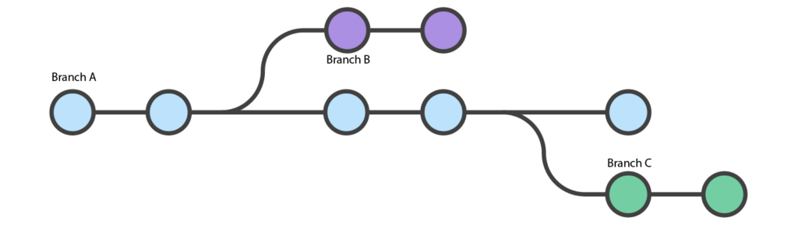

### ¿Para que sirven las ramas? 🤔

En pocas palabras una rama **sirve para aislar el trabajo de cada persona** y que, una vez concluido, se pueda integrar en el tronco de nuestro repositorio que será, dicho de otro modo, la rama principal.

### ¿Qué representa la rama master o la rama main?

La rama master es la rama principal de un repositorio y normalmente se crea al iniciar un repositorio. **El hecho que se llame master no es obligatorio** y en realidad responde a una razón histórica. Simplemente siempre se le ha llamado así.

En la actualidad servicios como GitHub o GitLab **recomiendan que la rama principal sea llamada main** para evitar connotaciones racistas. 😅

### Creando nuestra primera rama 🌱

El comando **git branch** nos permite crear, listar, eliminar y renombrar ramas, ahora veremos los pasos para crear nuestra primera rama.

* **Paso 1:** Ingresamos a nuestra terminal de Visual Studio Code o con la que te sientas mas comodo.

* **Paso 2:** Creamos la rama mi-primera-rama con el siguiente comando.

    ```
    git branch mi-primera-rama 
    ```
* **Paso 3:** Verificamos que se creo la rama con el siguiente comando.

    ```
    git branch 
    ```
Como podemos ver ya tenemos nuestra nueva rama creada 😲

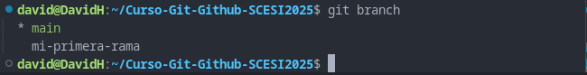

* **Paso 4:** Para cambiarnos a la rama que creamos utilizamos el comando git switch con el nombre de la rama creada.

    ```
    git switch mi-primera-rama
    ```
Listo ya estamos en la rama mi-primera-rama que creamos 😁

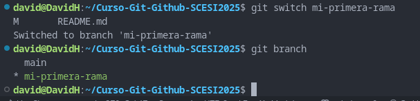

* **Dato curioso:** Si queremos simplificar los pasos podemos crear nuestra rama y cambiarnos a ella al mismo tiempo 😱

    ```
    git switch -c mi-segunda-rama
    ```
Listo, con el comando git switch -c con el nombre de nuestra rama por delante podemos crear la rama y cambiarnos a ella 💯

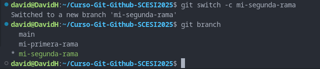

### Fusionando ramas 🔀 

Las bifurcaciones de código que hemos creado en forma de ramas tendrán dos destinos:

* Acabar en el olvido para no terminar en ningún lado.
* Ser fusionada en otra rama.

Cuando hablamos de fusión nos referimos a que los cambios que hemos realizado en la rama se integran en otra rama, de forma que el código que habíamos generado
en la nueva rama se asimila en otra.

* **📌 Nota:** Aunque normalmente este tipo de fusión ocurre de una rama a la rama principal, debes tener en cuenta que en realidad podemos fusionar una rama con cualquier otra rama.

**Usando git merge ✍️**

Este comando nos permite incorporar los cambios de una rama a la rama en la que nos encontramos en ese momento. Por ejemplo, si estamos actualmente en la rama
main y hacemos un git merge my-branch haremos que la rama main incorporé y fusione los cambios que había en la rama my-branch.

* Si tienes cambios sin guardar en tu rama actual, Git no te permitirá fusionar nada hasta que los guardes, hagas commit o los elimines.

A continuación veremos los pasos para hacer un git merge 🔥

* **Paso 1:** Ingresamos a nuestra terminal de Visual Studio Code o con la que te sientas mas comodo.

* **Paso 2:** Nos aseguramos que estamos en la rama destino.

    ```
    git branch --show-current
    ```
Esto nos dira en que rama estamos actualmente, en mi caso es la main 🌿

* **Paso 3:** Vamos a incorporar en main los cambios de my-branch

    ```
    git merge my-branch
    ```
Listo, si ahora ejecutamos un git log veremos que el último commit incluye la palabra Merge, este commit justamente incluye todos los cambios que se habían realizado en la rama my-branch.

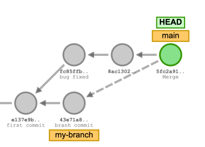

Al ejecutar el comando git merge, se crea un nuevo commit que incluye todos los cambios de la rama de origen a la rama en la que nos encontramos ahora.

**Modificando el mensaje de commit 🚀**

Al ejecutar el git merge, Git nos ha creado un commit y lo ha grabado. Sin embargo, si queremos evitar esto. Tenemos dos opciones para que no lo haga y, así, modificar el mensaje del commit

1. Abre el editor antes de hacer el commit

    ```
    git merge --edit
    ```

2. Evita que haga commit automáticamente

    ```
    git merge --no-commit
    ```

Aunque puede ser útil en algunos casos muy concretos lo cierto es que lo normal es simplemente dejar que Git haga el commit automáticamente. ✅

### Eliminando ramas 🗑️

Después de fusionar una rama en otra rama tenemos que eliminarla para tener limpio nuestro espacio de trabajo y por que son buenas practicas.

* Borramos la rama llamada "mi-primera-rama"

    ```
    git branch -d mi-primera-rama
    ```

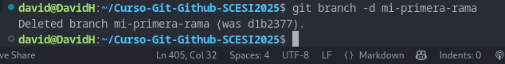


* ✅ Si la rama ya ha sido fusionada previamente, entonces todo habrá ido correctamente y nos habrá devuelto el mensaje:

    ```
    Deleted branch mi-primera-rama (was 7c60765)
    ```

* ❌ Si la rama no la habías fusionado (merge) previamente, entonces te devolverá un error:

    ```
    error: The branch 'mi-primera-rama' is not fully merged.
    If you are sure you want to delete it, run 'git branch -D mi-primera-ra\
    ma'.
    ```
En el caso que quieras borrar una rama que no ha sido fusionada previamente, tenemos que usar
el parámetro -D.

* Borramos la rama llamada "mi-primera-rama"

    ```
    git branch -D mi-primera-rama
    ```

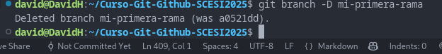

Con eso borramos la rama que no fue fusionada previamente 💯

### Conflictos en Git 💥

Un conflicto es una situación en la que Git no es capaz de determinar qué cambio es el que tiene que prevalecer una vez ocurra la fusión y, por lo tanto, requiere que el usuario lo resuelva.

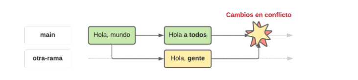

Dada la naturaleza de sistema distribuido, es normal que a veces ocurran conflictos al intentar fusionar dos ramas en Git. ¿Cómo iba a saber Git qué cambio es más importante que otro?

**Solucionando conflictos 🔧**

1. Primeramente localizamos nuestro archivo que tiene conflictos, nos mostrara algo como esto:

    ```
    <<<<<<< HEAD Marca el inicio de los cambios que existe en tu rama actual.
    ======= Es el separador entre las dos versiones de codigo en conflicto.
    >>>>>>> Marca el final de los cambios provenientes de la otra rama que intentamos fusionar.
    ```

2. Aquí tenemos que decidir con que cambios quedarnos, con los cambios de nuestra rama actual o con los cambios provenientes de la otra rama, tambien podemos conbinar ambos.

**📌 Nota:** Una vez que escogemos con que cambios quedarnos tenemos que eliminar los marcadores **(<<<<<<<, =======, >>>>>>>)**.

3. Marcamos el conflicto como resuelto, hacemos un git add del archivo que tenia conflictos.

    ```
    git add nombre_del_archivo_con_conflicto
    ```
4. Como ultimo paso realizamos un commit.

    ```
    git commit -m "Conflicto resuelto"
    ```

Con estos pasos finalizamos el proceso y el conflicto queda resuelto ✨

## Github, push pull y pull-request


### ¿Para que se usa github? 🐙

Github generalmente es utilizado con las siguientes finalidades:

* 📁 Guardar código en la nube.

* 👥 Colaborar en git clone https://repositorio_objetivoequipo.

* 🕒 Llevar el historial de cambios.

* 🐛 Reportar y solucionar errores (issues).

* 🚀 Desplegar y mantener proyectos open source o privados.

### ¿Github y git son lo mismo? 🤔

No, Github y Git son totalmente diferentes.

* **Github es un servicio de alojamiento en la nube** de codigo fuente basado en el sistema de control de versiones que ofrece git, tambien tenemos otros servicios de alojamiento como **GitLab** y **Bitbucket**.


* **Git** por otro lado es un **sistema de control de versiones**.

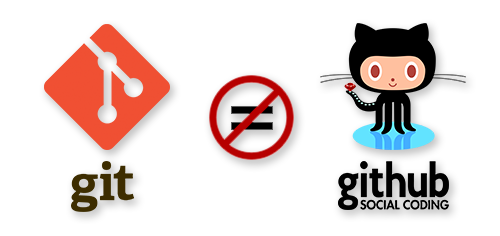

### Repositorios remotos 🌐

Los repositorios remotos son repositorios que están hospedados en un servidor y que servirá de punto de sincronización entre diferentes repositorios locales.

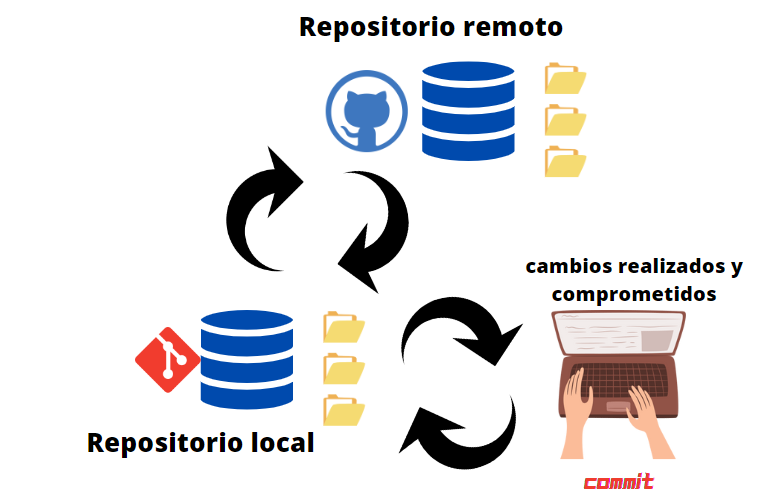

Los repositorios remotos no están en nuestra máquina. Están hospedados en un servidor externo pero podremos sincronizar nuestros cambios cuando queramos.

### Enlazar un repositorio remoto con un repositorio local 🌐 💻

Ahora veremos paso a paso como enlazar nuestro repositorio remoto con el repositorio local.

* **Paso 1:** Nos dirigimos a Gihub, entramos a la sección de repositorios y creamos un nuevo repositorio.

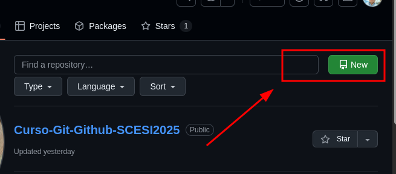

* **Paso 2:** Asignamos el nombre a nuestro repositorio y lo colocamos en publico si queremos que sea visible para otros usuarios, caso contrario en privado.

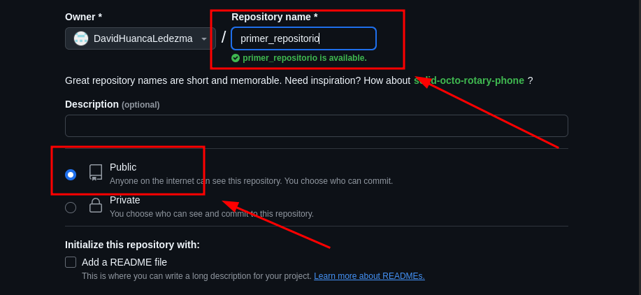

* **Paso 3:** Deslizamos abajo y presionamos el boton create repository, con eso ya tenemos creado nuestro repositorio en Github.

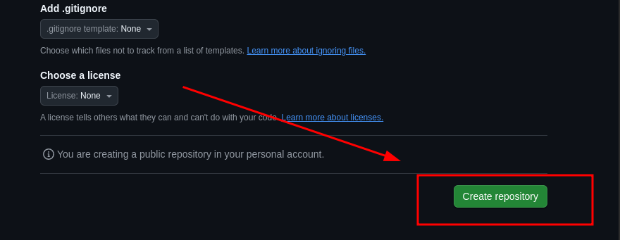

* **Paso 4:** Copiamos el link de nuestro repositorio de Github.

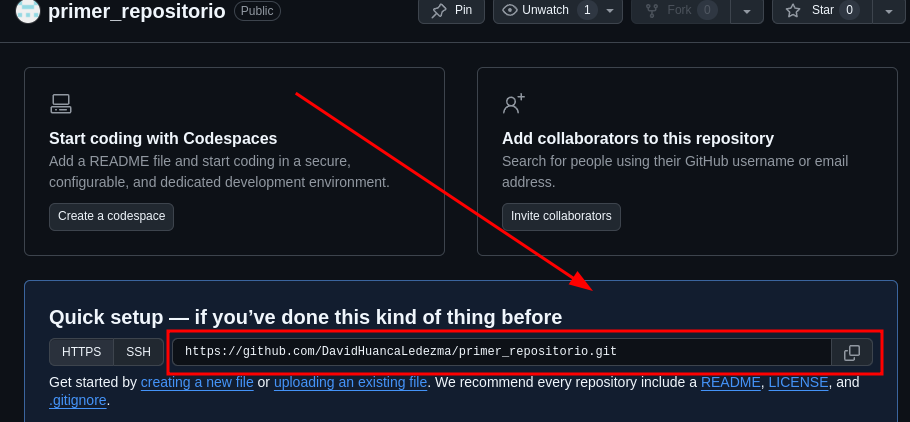

* **Paso 5:** Enlazamos el repositorio remoto con el local desde nuestra consola.

    ```
    git remote add origin https://github.com/DavidHuancaLedezma/primer_repositorio.git
    git push -u origin main
    ```
* **Paso 6:** Verificamos que se enlazara correctamente. 

    ```
    git remote -v
    ```
    Esto nos mostrara algo así
    ```
    origin  https://github.com/DavidHuancaLedezma/primer_repositorio.git (fetch)
    origin  https://github.com/DavidHuancaLedezma/primer_repositorio.git (push)
    ```
* **Paso 7:** Cambiamos el nombre de la rama master a main.

     ```
    git branch -M main
    ```
* **Paso 8:** Enviamos nuestros commits al repositorio remoto y a la rama main.

    ```
    git push -u origin main
    ```

    Listo, con todo eso terminamos de Sincronizar nuestro repositorio remoto con el local. 🥳
    

* 📌**Nota:** Cuando enlazamos el repositorio con **git remote add origin**, no es obligatorio colocar el origin, puede ser otra palabra el origin es simplemente una convención que se coloca normalmente.

**Usando clone en git** 🧬

* Para clonar un repositorio de Github unicamente utilizamos el git clone, esto nos permite tener el repositorio en nuestro entorno local y modificarlo a nuestro gusto pero no podemos subir esos cambios al repositorio del cual clonamos este, a menos que seamos colaboradores. 👀
    ```
    git clone https://repositorio_objetivo
    ```
**Eliminando ramas del repositorio local que ya no existen**

Si una rama se elimina en el servidor, Git no borra automáticamente la referencia local, git remote prune origin nos sirve para eso:

* 🗑️ Borra esas referencias obsoletas en nuestro repositorio local.

* 🌿 No afecta a ramas locales ni al servidor remoto.

* 🧹 Solo "limpia" lo que ya no existe en el origin.

    ```
    git remote prune origin
    ```

### ¿Cual es la diferencia entre git push y git pull? 🤔

* 📤 **git push:** Se utiliza para subir nuestros cambios de nuestro repositorio local al remoto.
    ```
    git push
    ```
* 📥 **git pull:** Baja las actualizaciones que hay en el repositorio remoto a nuestro repositorio local. 
    ```
    git pull
    ```

**Comandos con force ⚠️**

Podemos forzar el comando push pero esto trae consecuencias.

1. ☠️ En el caso de git push al forzar la actualización del repositorio elimina los commits remotos que no esten en tu version local 

2. ☠️ Es destructivo si alguien más está trabajando en la misma rama.

    ```
    git push -f
    ```

**Uso de --set-upstream**

Con el --set-upstream asociamos una rama remota con la local para luego escribir simplemente git push en lugar de git push origin main por ejemplo:

* ⏮️ Antes teniamos que colocar todo el comando.

    ```
    git push origin main
    git pull origin main
    ```

* ⚙️ Configurando --set-upstream.

    ```
    git push origin --set-upstream main
    git pull origin --set-upstream main
    ```
* 🙀 Despues unicamente tenemos que colocar la versión resumida.

    ```
    git push 
    git pull
    ```

**Uso de --all 🎯** 

Si queremos subir todas las ramas locales a las remotas podemos hacerlo con --all, por ejemplo:

* Supongamos que tenemos las sigientes ramas.

    ```
    main
    dev
    hotfix
    ```

* Al ejecutar git push --all es como si subieramos todo
    
    ```
    git push --all
    ```

* Git lo interpretaria como subir todas las ramas.

    ```
    git push origin main
    git push origin dev
    git push origin hotfix
    ```

### ¿Que es una pull request? 🤔

Pull request o tambien dicho como PR es una petición de cambios supervisado que se realiza desde Github, en pocas palabras otra persona tiene que revisar y aprobar los cambios que estas intentando hacer a una rama desde otra.


### Proceso para hacer una pull request

Para hacer una pull request tenemos que entrar a Github, al apartado de pull request de nuestro respectivo repositorio y seguir los siguientes pasos:

* **Paso 1:** Creamos una nueva pull request.

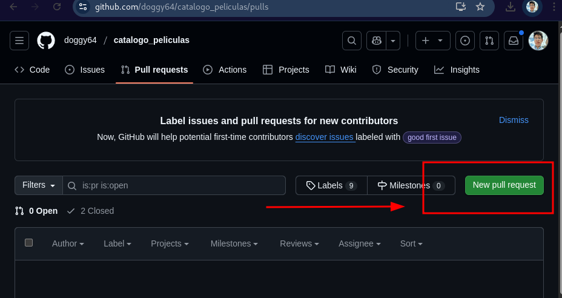

* **Paso 2:** Seleccionamos como rama base a la rama que se fusionara los cambios entrantes de la rama que escogimos como compare.

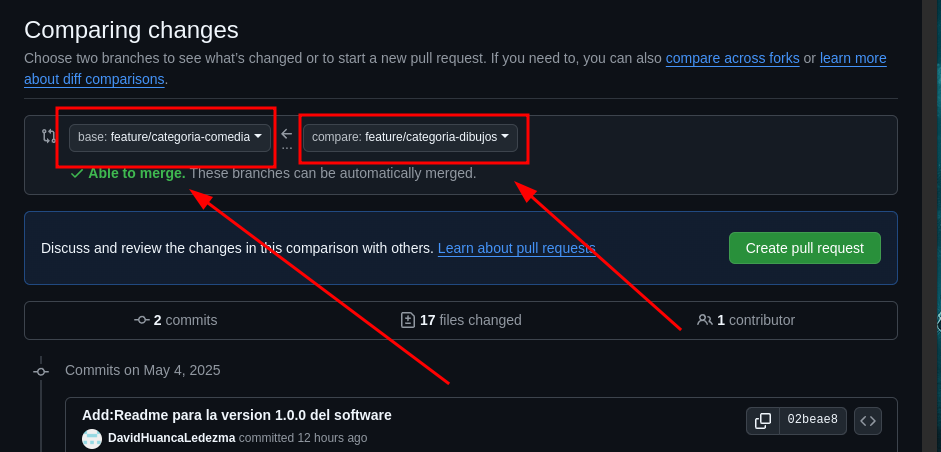

* **Paso 3:** Agregamos un título, comentario y quien revisara la PR, posteriormente creamos la PR y esperamos su revisión. 

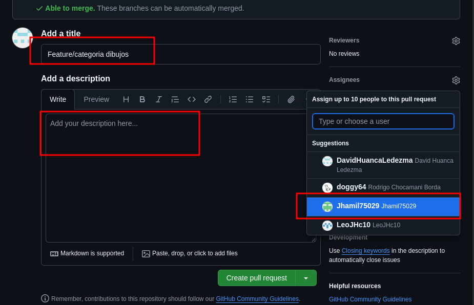

* **Paso 4:** La PR estara ya creada y esperando su revisión por el usuario que asignamos.

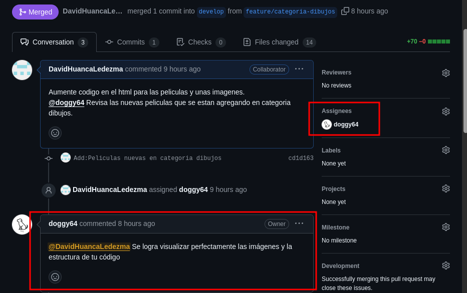 

* **Paso 5:** Una vez aceptada la PR procedemos a realizar la unión de las ramas correspondiente.

### Hacer una buena PR

1. 🧑‍💻 **Enfoca tu codigo en una sola cosa:** Hay que realizar una funcionalidad pequeña para que la persona que revise la PR pueda enterder nuestro codigo pequeño y puntual.

2. 📚 **Explica tu pull request:** Hay que explicar la PR por medio de los comentarios que nos proporsiona Github y adjuntar imagenes para que facilite a la persona que esta revisando la PR.

### Revisar una PR

Al revisar una PR, es importante seguir los siguientes aspectos clave.

1. 💬 **Proporcionar feedback:** Siempre brindar recomendaciones positivas, en el caso de encontrar errores.

2. 🧠 **Entiende el contexto:** Comprende qué problema resuelve y por qué se hicieron los cambios.

3. 🧯 **Piensa en el impacto a largo plazo:** Este cambio puede romper algo en el futuro?

## Flujos de trabajo y estrategias de ramas en Git

Las cuatro estrategias más famosas que se pueden seguir a la hora de trabajar en equipo son **Git Flow**, **GitHub Flow**, **Trunk Based Development** y la estrategia más moderna, llamada **Ship / Show / Ask**.

📌 **Nota:** Usar una buena estrategia en un proyecto puede determinar la velocidad, o incluso el éxito, de los desarrollos del equipo.

### Git Flow 🚀

Una de las estrategias más famosas a la hora de trabajar en equipo es Git Flow. Fue ideada por el desarrollador de Vincent Driessen en el año 2010, pero es uno de los flujos de trabajo mas antiguo que contiene las siguientes ramas:

* 🌳 **main:** Su propósito es contener el código que se encuentra en producción.

* 🧑‍💻 **develop:** Contiene el código en desarrollo pre-producción.

* 🌿 **feature/nombre:** Cuando trabajas en una nueva característica para el proyecto.

* 🔥 **hotfix/nombre:** Correcciones urgentes sobre main.

* 🔍 **release/nombre-versión:** Aquí preparas el lanzamiento de una nueva versión.

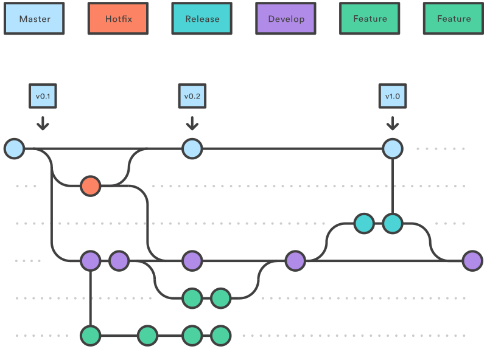

En la siguiente imagen se presentan todas las ramas necesarias para poder seguir la estrategia.

**Funcionamiento del flujo de trabajo** 💼

El flujo de trabajo consiste en:

1. Crear una rama develop a partir de la rama main.

2. Crear una rama feature a partir de develop para desarrollar una nueva funcionalidad.

3. Una vez finalizada la funcionalidad de feature se realiza una integración con develop.

4. Al finalizar el develop, se crea una rama release desde develop para pruebas finales y preparar el lanzamiento de una nueva versión.

5. Al terminar en el release se hace una integración a main para sacar una versión terminada del software.

6. Las ramas hotfix se crean desde el main para arreglar bugs en producción y al terminarse, se integran a main con una nueva versión del software.

### Github Flow 🐙

**GitHub Flow** es una estrategia creada por la propia **GitHub** y pensada especialmente para equipos y proyectos que hacen despliegues de forma regular. Se basa en la creación de Pull Requests que serán discutidas para que se integren en la rama principal.

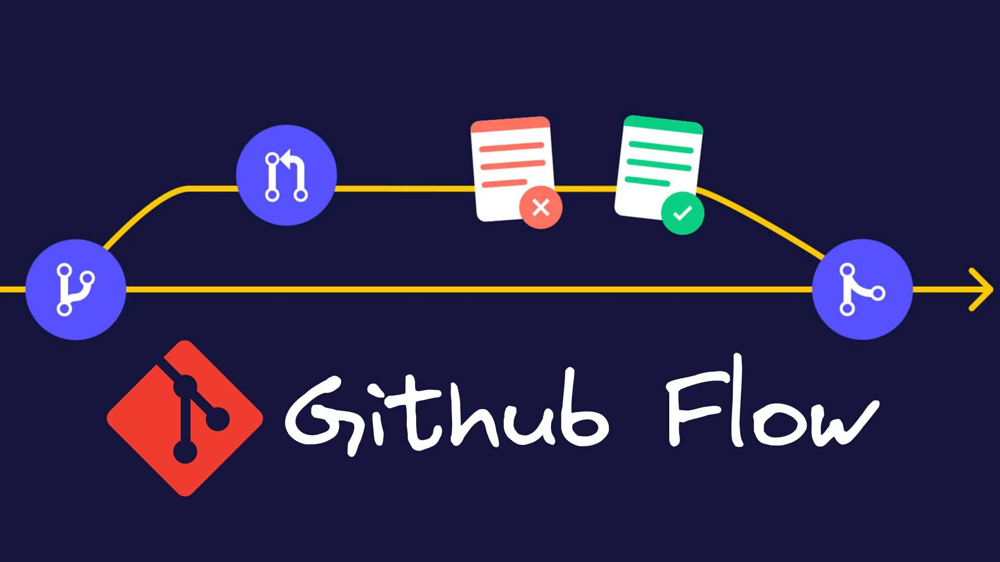

GitHub Flow es una alternativa más simple de Git Flow. Tiene menos liturgias, es más fácil de entender y favorece los despliegues continuos de tu proyecto.

GitHub Flow tiene dos tipos de ramas:

* 🌳 **main:** La rama principal que contiene los cambios que se despliegan regularmente.

* 🌿 Cualquier otra rama que quiere ser integrada en la rama principal.

### Trunk Based Development 🌳

El Trunk Based Development es una estrategia que se basa en que el mayor tiempo de desarrollo se concentra en una sola rama llamada trunk que corresponde a la main. 


En esta estrategia se prioriza hacer commits directamente a la rama principal. En el caso de necesitar ramas, se hacen Pull Request pequeñas y que duren poco tiempo para ser integradas lo antes posible.

**Beneficios de Trunk Based Development**

* 🔁 Integración continua y menos fricción.

* 👷 Menos trabajo manual.

* 🚀 Despliegue a producción continuo.

### Ship / Show / Ask 🍨

Ship / Show / Ask es una estrategia de ramas que combina la idea de crear Pull Request con la habilidad de seguir publicando cambios rápidamente.

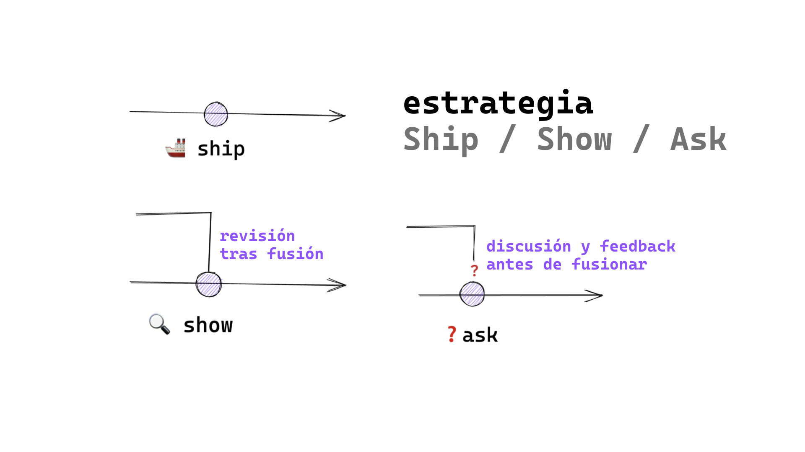

Los cambios que creamos en el repositorio se categorizan en tres:

1. ⚡ Ship: Se fusiona en la rama principal sin revisión.

2. 🔍 Show: Abre una petición de cambios para que sean revisados por CI pero se fusiona inmediatamente.

3. ❓ Ask: Abre una PR para discutir los cambios antes de fusionarlos

**Las reglas de Ship / Show / Ask**

1. 🚀 Tenemos un buen sistema de CI/CD, fiable y rápido, que hace que la rama principal siempre sea desplegable

2. 👥 Confiamos en el equipo y existen buenas prácticas de desarrollo.

3. 🧑‍💻 Las revisiones de código no son requerimientos para que las PRs sean fusionadas.

4. 🌿 Las ramas tienen un tiempo de vida corto.

5. 🤝 El equipo ha sabido lidiar con el ego individual, las personas confían en el resto del equipo y las pruebas automáticas pasan.

## Buenas prácticas en git

Las buenas practicas son un estándar manejado en la mayoría de equipos de desarrollo, ayuda a resolver conflictos o problemas durante el desarrollo con más facilidad.

### Frecuencias para escribir commits

 **¿Cada cuánto debería hacer un commit?** 🤔

**A menudo** hay que hacer commits con las siguientes recomentaciones:

* 🐣 Es mejor hacer commits pequeños con pequeñas mejoras que un commit con todo lo que se quiere hacer.

* 🧩 Divide la tarea en trozos pequeños. Cada
trozo es un commit.


Hacer commit a menudo no significa que debas hacer commits sin sentido. Graba tus progresos en iteraciones pequeñas pero que tengan un significado.

### Escribir buenos commits ✏️

Para escribir buenos commits usamos el verbo imperativo add, change, fix, remove al inicio de cada commit.

* **Add:** Agregando una nueva funcionalidad.

* **Change:** Modificando una funcionalidad existente.

* **Fix:** Corrigiendo un error o bug.

* **Remove:** Eliminando código, archivos o funcionalidades.


Usa como máximo **50 caracteres para tu mensaje de commit**, sé corto y conciso, si tienes mucho que explicar es probable que tu commit contenga demasiados cambios.

* ❌ Muy largo.

    ```
    git commit -m "Add new search feature and change typography to improve \performance"
    ```

* ✅ Corto y compresible.

    ```
    git commit -m "Add new search feature"
    ```


**Otras buenas practicas que tienes que seguir** 📋	

* No uses punto final ni puntos suspensivos en tus mensajes.

* El commit tiene que estar escrito todo con letra minuscula.

### Prefijos para escribir commits ✏️

Utilizamos prefijos para que los commits sean más semánticos, cuando un proyecto crece, es necesario que existan ciertas reglas para que el historial sea legible, a continuación veremos la lista de los prefijos utilizados:

1. **feat:** para una nueva característica para el usuario.

2. **fix:** para un bug que afecta al usuario.

3. **perf:** para cambios que mejoran el rendimiento del sitio.

4. **build:** para cambios en el sistema de build, tareas de despliegue o instalación.

5. **ci:** para cambios en la integración continua.

6. **docs:** para cambios en la documentación.

7. **refactor:** para refactorización del código como cambios de nombre de variables o funciones.

8. **style:** para cambios de formato, tabulaciones, espacios o puntos y coma, etc; no afectan al usuario.

9. **test:** para tests o refactorización de uno ya existente.

### Escribe un buen nombre de rama ✏️

Al nombrar las ramas tenemos que seguir el mismo patron, si elegimos que todas las ramas se escriban en mayusculas entonces debemos hacer eso para todas, a plicamos la misma logica si queremos escribirlas con minisculas.

En las ramas debemos espesificar que tipo de acción realizara como por ejemplo:

* 🐞 **bug:** Cambios de código para arreglar un bug conocido.

* ✨ **feature:** Desarrollo de una nueva característica.

* 🔬 **experiment:** Experimentos que nunca serán fusionados.

* 🔥 **hotfix:** Cambio rápido de un error crítico.

**📌 Nota:** No necesariamente tiene que estar escrito en ingles las ramas, en el caso que el equipo de desarrollo sean hispanohablantes se pueden nombrar en español las ramas.


**IDs de JIRA** 🆔

Aunque la convención anterior es una buena forma de identificar de qué tipo de rama se trata, es muy importante que el nombre de la rama sea único.

El nombre de la rama a veces no da el suficiente contexto
para saber realmente en qué trabaja o qué soluciona. Para ello, una buena idea es adjuntar al principio del nombre de la rama la ID del ticket.

* Por ejemplo:
    ```
    989-hotfix/fix-typo-in-name
    1110-feature/add-new-user-form
    1240-experiment/try-new-ui-design
    1255-hotfix/fix-typo-in-name
    ```
Ahora es mucho más fácil buscar más contexto sobre estas ramas, pese a que no quede claro con su propio nombre. 💯

## Deshacer cambios

Tenemos algunos casos en los cuales debemos deshacer cambios, entre ellos estan los siguientes casos:

* Dejó de funcionar el proyecto.

* Queremos recuperar una parte del código que eliminamos.

* Queremos recuperar archivos que eliminamos.

### Comandos destructivos y no destructivos 💣

Los comandos destructivos afectan el historial de commits realizados mientras que los no destructivos unicamente trabajan en base al historial sin afectarlo.

**Comandos no destructivos** 😊

Entre los comandos no destructuvos tenemos el reset para eliminar el commit el cual posee 2 opciones:

* **soft:** Mantiene los cambios que ocurrieron antes de hacer commit desde donde apuntaba.

    ```
    git reset --soft HEAD~<N>
    git reset --soft <SHA>
    ```

* **hard:** Descarta los cambios y el commit.

    ```
    git reset --hard HEAD~<N>
    git reset --hard <SHA>
    ```

**Comandos destructivos** ☠️

Entre los comandos destructuvos tenemos el revert:

* **revert:** revierte los cambios que un commit introdujo, y crea un nuevo commit con los cambios revertidos.

    ```
    git revert HEAD~<N>
    git revert <SHA>
    ```

**Otros comandos** 🎯

El git checkout no es destructivo por sí solo, pero puede causar pérdida de cambios no guardados si no tenemos cuidado.

* **git checkout:** Nos permite recuperar código específico de commits.

    ```
    git checkout <SHA>
    ```


**📌 NOTA:** En el HEAD N reemplazamos el número de pasos para volver al commit que queremos, mientras que en SHA utlilizamos el id del commit al cual queremos volver.


## Hooks, Alias y Trucos Git

### Hooks ⭐

Un hook, o punto de enganche, es la posibilidad de ejecutar una acción o script cada vez que ocurre un evento determinado de git, tenemos hooks del lado del cliente y del servidor.

**Hooks del lado del cliente** 👤

Sólo afectan al repositorio local que los contiene.

* **pre-commit:** Podrías comprobar si se está intentando hacer un commit de demasiados archivos.

* **prepare-commit-msg:** Para modificar el mensaje del commit o añadir cualquier información extra.

* **commit-msg:** Es el sitio perfecto para hacer todas las comprobaciones pertinentes al mensaje.

* **post-commit:** Su uso principal es la de notificar por Slack.

* **pre-push:** Para ejecutar una batería de tests.

* **post-checkout y post-merge:** Permite limpiar el directorio de trabajo, tras realizar un checkout, o el de limpiar las ramas que ya no se usan tras realizar un merge.

**Hooks del lado del servidor:** 🗄️

En el lado del servidor, en el repositorio remoto, tenemos tres puntos de enganche:

* **pre-receive:** Para comprobar que los commits que se quieren guardar están bien formados.

* **update:** Puedes evitar de una forma granular cada actualización.

* **post-receive:** Enviar un correo a todos los usuarios del repositorio que se han grabado nuevos cambios en el repositorio remoto.


**Creando un hook** ⚡

Para crear un propio hook sólo tienes que crear un archivo nombre-del-hook en la carpeta .git/hooks y en él poner el código que quieras que se ejecute.

### Alias 🎯

Los alias pueden ser sencillos atajos para comandos que pueden ser usados en lugar de los nombres completos.

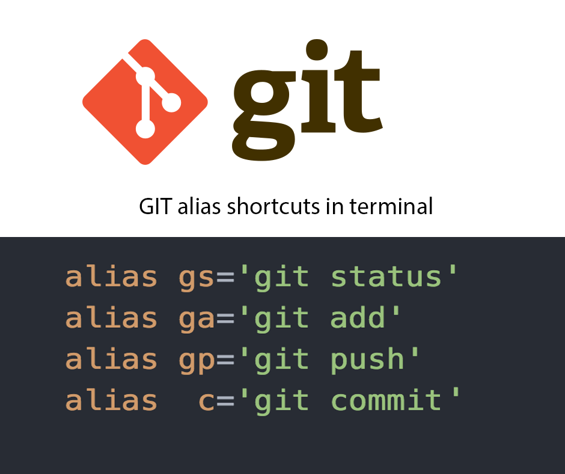


Git te permite crear tus propios alias fácilmente para comandos que usas habitualmente en tu proyecto con este sistema de control de versiones.

* Para crear tu propio comando debes usar el comando git config y ponerlo de la siguiente manera:

    ```
    git config --global alias.[nombre-del-alias] "comando a ejecutar"
    ```

### Trucos en git 🪄

1. 💾 Guarda tus cambios temporalmente.

    ```
    git stash
    git stash -u
    git stash pop
    ```

2. 🔁 Aplicar cambios de commits en específico.

    ```
    git cherry-pick <SHA>
    ```

3. 🐞 Detectar qué commit es el que ha introducido un bug.

    ```
    git bisect
    git bisect start
    git bisect bad
    git bisect good
    git bisect reset
    ```

4. 🔁 Cambiar el nombre de un commit.

    ```
    git commit --amend -m <descripcion commit>
    ```
5. 🌿 Recupera un archivo en concreto de otra rama o commit.

    ```
    git checkout <SHA> <archivo>
    ```


