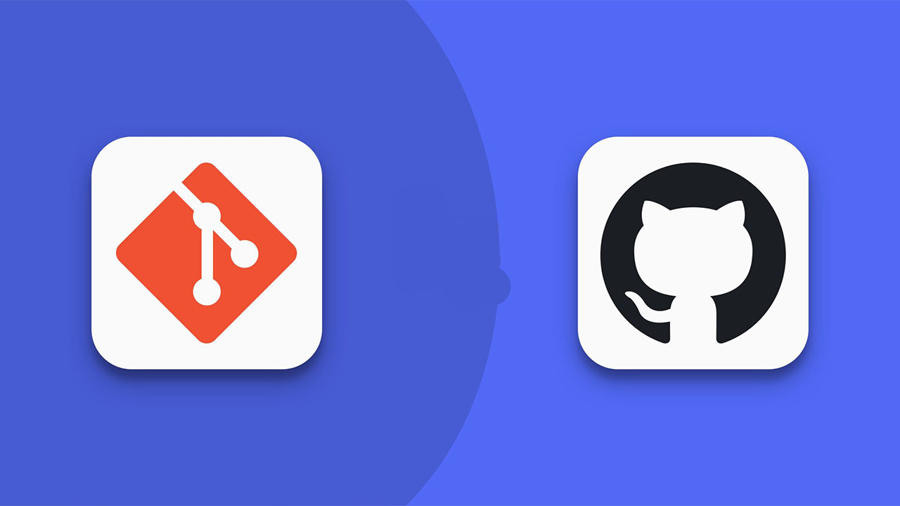

# Curso de Git & Github

## Descripción del curso 🚀 
📝 Este documento contiene mis notas personales sobre el curso de git y github para las configuraciones iniciales de git como los comandos que se utilizan para trabajar con proyectos de software, del mismo modo revisaremos las mejores practicas que se utilizan en git.

 ## 📋 Índice
> 1. [**Introducción a Git** 🚀](#introducción-a-git)
> 2. [**States y commits** 🚀](#states-y-commits)


## Introducción a Git


### ¿Qué es Git? 🤔
Git es un sistema distribuido de control de versiones, gratuito y de código abierto bajo licencia GPLv2. Fue diseñado originalmente por Linus Torvalds12, el creador de Linux.
Git, al ser un sistema distribuido, aloja una copia completa del repositorio en cada máquina local que está trabajando en el código.


### Instalación Git

**➊ Linux(Ubuntu\Debian) 🐧**

* Lo instalamos desde el repositorio de software de nuestra distrubución ejecutamos los siguientes comandos en nuestra terminal:

    ```
    sudo apt update
    sudo apt install git
    ```
* Verificamos la version de git que se instalo:
    ```
    git --version
    ```
Con eso ya tenemos git funcionando en nuestro Debian 💯

**➋ MacOS 🍏**

 En macOS la forma de instalar git es con **Homebrew** a continuación te dejo los pasos para la instalación correctamente:
* Instalar **Homebrew** si aún no lo tienes instalado 🔧
* Instalar git con brew 🔥
* Verificamos la versión de git que se instalo 💯

    ```
    xcode-select --install/bin/bash -c "$(curl -fsSL https://raw.githubusercontent.com/Homebrew/install/HEAD/install.sh)"

    brew install git

    git --version
    ```

**➌ Windows 💻**

En Windows es más sencillo descargar el instalador oficial y seguir los pasos del
asistente:

* Descargarga el instalador de 👉[https://git-scm.com/download/win](https://git-scm.com/download/win)

* Ejecuta el instalador 🔥

* Finaliza la instalación 💯

### Configuración de Git 🛠️

Para hacer que tus commits se asocien a tu nombre y aparezca correctamente tu
avatar en la plataforma de GitHub, necesitamos realizar la siguiente configuración.


1. Configura tu nombre 😀

    ```
    git config --global user.name "<tu nombre>"
    ```
2. Configura tu correo electronico ✉️

    ```
    git config --global user.email "<tu email>"
    ```
📌**NOTA**: El correo electronico tiene que ser el mismo con el que estas registrado en Github

**Otras configuraciones adicionales ⚙️** 

* Para comprobar nuestra configuración de git ejecutamos el siguiente comando

    ```
    git config --list
    ```
* Si necesitamos ayuda y mas opciones de configuración 

    ```
    git config --help
    ```

### Inicializar un repositorio Git desde cero y subirlo a GitHub 🐱

**➊ Creamos nuestro archivo README.md**

* Este archivo contendra toda la información sobre nuestro proyecto.

    ```
    echo "# Curso-Git-Github-SCESI2025" >> README.md
    ```
**➋ Inicializar un repositorio**

 * Inicializamos un repositorio Git vacío en tu nuestra carpeta actual.

    ```
    git init
    ```
Con eso ya tenemos inicializado nuestro repositorio pero solamente de forma local.

**➌ Agregar el archivo**

* Agregamos nuestro archivo README.md al área de preparación para que se pueda subir a Github.

    ```
    git add README.md
    ```

**➍ Commit inicial**

* Creamos nuestro primer commit para que se guarden los cambios del README.md

    ```
    git commit -m "first commit"
    ```

**➎ Cambio de nombre de la rama**

* Cambiamos el nombre de nuestra rama a main ya que inicialmente esta con Master

    ```
    git branch -M main
    ```

**➏ Conexión del repositorio local con el remoto**

* Conectamos nuestro repositorio local con el remoto con la url que nos proporciona Github 

    ```
    git remote add origin https://github.com/TuNombreDeGithub/Curso-Git-Github-SCESI2025.git
    ```

**➐ Envio del commit a Github**

* Enviamos el commit inicial que realizamos a la rama main, el -u vincula nuestra rama local con la rama remota.

    ```
    git push -u origin main
    ```

Listo y con esos 7 pasos ya tenemos nuestro repositorio Git Inicializado y subido a Github 😎

## States y commits

### Los 3 estados de Git 🎯
Cuando usamos Git, los archivos de nuestro proyecto se pueden encontrar en uno de los siguientes
estados:

1. Modified: El archivo contiene cambios pero todavía no han sido
marcados para ser confirmados. Se encuentra en el directorio de trabajo.

2. Staged: Son los archivos que han sido modificados en el directorio
de trabajo y se han marcado como preparados para ser confirmados en el
repositorio local. Se encuentran en un área temporal transitoria. Esta acción
recibe el nombre de add.

3. Committed: El archivo se encuentra grabado en el repositorio
local. Esta acción recibe el nombre de commit.


### ¿Qué es un commit? 🤔
* 📝 Los commits sirven para registrar los cambios que se han producido en el repositorio, es una de las piezas más importantes para entender cómo funciona Git.

* 📷 Piensa en los commits como si fuesen fotografías. Cada fotografía muestra el
estado de todos los archivos de tu repositorio en el momento en que se hizo y cada una va firmada con el autor, la fecha, localización y otra información útil.

* 🎮 En pocas palabras un commit es como un punto de guardado de la partida de tu juego.

**¿Cómo puedo hacer un commit?**
1. Si quieres guardar los cambios que tienes en el área de staging, puedes hacer un commit con el siguiente comando:

    ```
    git commit
    ```

2. Si quieres añadir directamente un mensaje sin abrir el editor, puedes usar el
parámetro -m o --message:

    ```
    git commit -m "Add new search feature"
    ```

### ¿Qué es el HEAD?

HEAD es el puntero que referencia el punto actual del historial de cambios del
repositorio en el que estás trabajando.
Normalmente será el último commit de la rama en la que te encuentres pero como
también puedes moverte entre commits es posible que HEAD no sea el último
commit.


### Otros comandos basicos de Git 💯

**Usando git add 👨‍💻** 

El comando git add en Git se usa para agregar archivos al área de preparación. Esto significa que estás indicando qué cambios quieres incluir en el próximo commit.

* ⭐**Primera opción:** Puedes agregar archivos espesicos al area de preparación, esto es una buena practica.
    ```
    git add archivo.txt
    ```

* 🙀**Segunda opción:** Puedes agregar todos los archivos al area de preparación al mismo tiempo, pero no es muy recomendado por que pueden a ver algunos archivos con errores que aún no fueron resueltos.
    ```
    git add .
    ```

**Usando git log 👨‍💻**

* ⭐**Primera opción:** Con git log podemos ver el lista de todos los commits realizados cronologicamente.

    ```
    git log
    ```
* 🙀**Segunda opción:** Para mostrar los commit en una forma mas compacta o de una sola linea utilizamos el siguiente comando

    ```
    git log --oneline
    ```
* ✨Al ejecutar el comando git log --oneline nos muestra esto

    ```
    23a97fc (HEAD -> main, origin/main) Add: Sección States y commits
    b6483db Add:Inicializar un repositorio y subirlo a Github
    e98ddd5 Add:Configuración de Git
    0cc4583 Add:Instalación de git en Linux/MacOS/Windows
    88eb6d0 Add:Introdicción a Git
    8f20b19 Add:Creación del repositorio
    ```
**Usando git status 👨‍💻**
* 🔥 Este comando lo utilizamos para ver el estado actual del repositorio, es decir, qué archivos han cambiado, cuáles están listos para hacer commit y cuáles no.

    ```
    git status
    ```
* ✨Al ejecutar el comando nos muestra esto:

    ```
    On branch main
    Your branch is up to date with 'origin/main'.

    Changes not staged for commit:
    (use "git add <file>..." to update what will be committed)
    (use "git restore <file>..." to discard changes in working directory)
        modified:   README.md

    no changes added to commit (use "git add" and/or "git commit -a")
    ```
## Ramas, merge y conflictos

### ¿Que es una rama? 🌿
Una rama es simplemente una versión de la colección de directorios y archivos del repositorio. Cada vez que se crea una nueva rama, **se crea una copia de la colección de archivos actual**.
A su vez, a **partir de esta rama puedes crear más ramas**.


### ¿Para que sirven las ramas? 🤔

En pocas palabras una rama **sirve para aislar el trabajo de cada persona** y que, una vez concluido, se pueda integrar en el tronco de nuestro repositorio que será, dicho de otro modo, la rama principal.

### ¿Qué representa la rama master o la rama main?

La rama master es la rama principal de un repositorio y normalmente se crea al iniciar un repositorio. **El hecho que se llame master no es obligatorio** y en realidad responde a una razón histórica. Simplemente siempre se le ha llamado así.

En la actualidad servicios como GitHub o GitLab **recomiendan que la rama principal sea llamada main** para evitar connotaciones racistas. 😅

### Creando nuestra primera rama 🌱

El comando **git branch** nos permite crear, listar, eliminar y renombrar ramas, ahora veremos los pasos para crear nuestra primera rama.

* **Paso 1:** Ingresamos a nuestra terminal de Visual Studio Code o con la que te sientas mas comodo.

* **Paso 2:** Creamos la rama mi-primera-rama con el siguiente comando.

    ```
    git branch mi-primera-rama 
    ```
* **Paso 3:** Verificamos que se creo la rama con el siguiente comando.

    ```
    git branch 
    ```
Como podemos ver ya tenemos nuestra nueva rama creada 😲


* **Paso 4:** Para cambiarnos a la rama que creamos utilizamos el comando git switch con el nombre de la rama creada.

    ```
    git switch mi-primera-rama
    ```
Listo ya estamos en la rama mi-primera-rama que creamos 😁


* **Dato curioso:** Si queremos simplificar los pasos podemos crear nuestra rama y cambiarnos a ella al mismo tiempo 😱

    ```
    git switch -c mi-segunda-rama
    ```
Listo, con el comando git switch -c con el nombre de nuestra rama por delante podemos crear la rama y cambiarnos a ella 💯


### Fusionando ramas 🔀 

Las bifurcaciones de código que hemos creado en forma de ramas tendrán dos destinos:

* Acabar en el olvido para no terminar en ningún lado.
* Ser fusionada en otra rama.

Cuando hablamos de fusión nos referimos a que los cambios que hemos realizado en la rama se integran en otra rama, de forma que el código que habíamos generado
en la nueva rama se asimila en otra.

* **📌 Nota:** Aunque normalmente este tipo de fusión ocurre de una rama a la rama principal, debes tener en cuenta que en realidad podemos fusionar una rama con cualquier otra rama.

**Usando git merge ✍️**

Este comando nos permite incorporar los cambios de una rama a la rama en la que nos encontramos en ese momento. Por ejemplo, si estamos actualmente en la rama
main y hacemos un git merge my-branch haremos que la rama main incorporé y fusione los cambios que había en la rama my-branch.

* Si tienes cambios sin guardar en tu rama actual, Git no te permitirá fusionar nada hasta que los guardes, hagas commit o los elimines.

A continuación veremos los pasos para hacer un git merge 🔥

* **Paso 1:** Ingresamos a nuestra terminal de Visual Studio Code o con la que te sientas mas comodo.

* **Paso 2:** Nos aseguramos que estamos en la rama destino.

    ```
    git branch --show-current
    ```
Esto nos dira en que rama estamos actualmente, en mi caso es la main 🌿

* **Paso 3:** Vamos a incorporar en main los cambios de my-branch

    ```
    git merge my-branch
    ```
Listo, si ahora ejecutamos un git log veremos que el último commit incluye la palabra Merge, este commit justamente incluye todos los cambios que se habían realizado en la rama my-branch.


Al ejecutar el comando git merge, se crea un nuevo commit que incluye todos los cambios de la rama de origen a la rama en la que nos encontramos ahora.

**Modificando el mensaje de commit 🚀**

Al ejecutar el git merge, Git nos ha creado un commit y lo ha grabado. Sin embargo, si queremos evitar esto. Tenemos dos opciones para que no lo haga y, así, modificar el mensaje del commit

1. Abre el editor antes de hacer el commit

    ```
    git merge --edit
    ```

2. Evita que haga commit automáticamente

    ```
    git merge --no-commit
    ```

Aunque puede ser útil en algunos casos muy concretos lo cierto es que lo normal es simplemente dejar que Git haga el commit automáticamente. ✅

### Eliminando ramas 🗑️

Después de fusionar una rama en otra rama tenemos que eliminarla para tener limpio nuestro espacio de trabajo y por que son buenas practicas.

* Borramos la rama llamada "mi-primera-rama"

    ```
    git branch -d mi-primera-rama
    ```


* ✅ Si la rama ya ha sido fusionada previamente, entonces todo habrá ido correctamente y nos habrá devuelto el mensaje:

    ```
    Deleted branch mi-primera-rama (was 7c60765)
    ```

* ❌ Si la rama no la habías fusionado (merge) previamente, entonces te devolverá un error:

    ```
    error: The branch 'mi-primera-rama' is not fully merged.
    If you are sure you want to delete it, run 'git branch -D mi-primera-ra\
    ma'.
    ```
En el caso que quieras borrar una rama que no ha sido fusionada previamente, tenemos que usar
el parámetro -D.

* Borramos la rama llamada "mi-primera-rama"

    ```
    git branch -D mi-primera-rama
    ```


Con eso borramos la rama que no fue fusionada previamente 💯

### Conclictos en Git 💥

Un conflicto es una situación en la que Git no es capaz de determinar qué cambio es el que tiene que prevalecer una vez ocurra la fusión y, por lo tanto, requiere que el usuario lo resuelva.


Dada la naturaleza de sistema distribuido, es normal que a veces ocurran conflictos al intentar fusionar dos ramas en Git. ¿Cómo iba a saber Git qué cambio es más importante que otro?

**Solucionando conflictos 🔧**

1. Primeramente localizamos nuestro archivo que tiene conflictos, nos mostrara algo como esto:

    ```
    <<<<<<< HEAD Marca el inicio de los cambios que existe en tu rama actual.
    ======= Es el separador entre las dos versiones de codigo en conflicto.
    >>>>>>> Marca el final de los cambios provenientes de la otra rama que intentamos fusionar.
    ```

2. Aquí tenemos que decidir con que cambios quedarnos, con los cambios de nuestra rama actual o con los cambios provenientes de la otra rama, tambien podemos convinar ambos.

**📌 Nota:** Una vez que escogemos con que cambios quedarnos tenemos que eliminar los marcadores **(<<<<<<<, =======, >>>>>>>)**.


